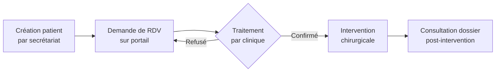
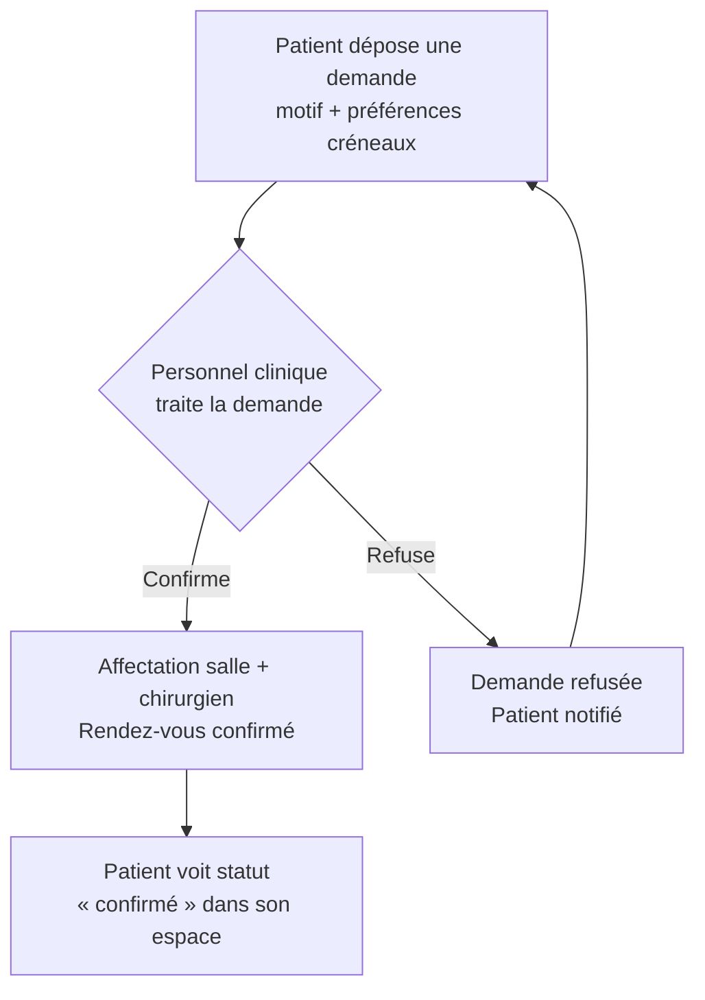
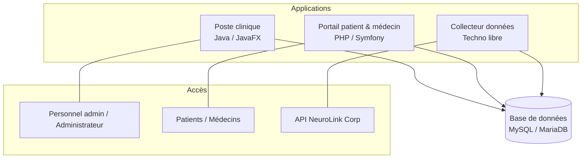

# NeuroLink Clinic

**Projet de développement — BTS SIO 2 option SLAM · Session 2026-2027**  
Support de l'épreuve E6

---

> [!NOTE]
> **Comment lire ce document** \
> Ce document est votre dossier de démarrage. Il décrit le contexte, le métier de la clinique, les contraintes techniques imposées et le contrat de l'API que vous allez consommer. **Il ne contient ni modèle de données, ni algorithmes, ni architecture applicative détaillée.** C'est *votre* travail : concevoir, justifier et faire valider.
>
> Le client est disponible en revue de jalon pour lever les ambiguïtés.

---

## Sommaire

| Partie | Contenu |
|--------|---------|
| **1** | Le contexte et ce qu'on attend de vous |
| **2** | Le métier de la clinique |
| **3** | Les règles de gestion |
| **4** | L'architecture imposée |
| **5** | Les spécifications techniques de démarrage |
| **6** | Le périmètre fonctionnel attendu |
| **7** | Organisation, jalons, évaluation |
| **8** | Vos premiers pas |

---

## Partie 1 — Le contexte

### 1.1 NeuroLink Clinic

Nous sommes dans une mégapole où l'augmentation cybernétique est devenue un acte médical courant. **NeuroLink Clinic** est un réseau de cliniques spécialisé dans le transhumanisme médical : elle pose et suit des implants cybernétiques — prothèses neuronales, interfaces sensorielles, régulateurs métaboliques, augmentations motrices.

Les implants ne sont pas fabriqués par la clinique. Ils sont conçus par la maison mère, **NeuroLink Corp**, qui maintient le catalogue et collecte les données des capteurs embarqués dans chaque implant posé. Ces données sont mises à disposition des cliniques par une API.

### 1.2 La situation actuelle

Le système d'information de la clinique tient dans un **tableur partagé**, un **agenda mural** et la **mémoire de trois personnes**. Les données des capteurs sont consultées manuellement, quand quelqu'un y pense — c'est-à-dire quand un patient appelle parce qu'il souffre, avec plusieurs semaines de retard sur les signaux qui auraient permis de l'anticiper.

> [!WARNING]
> **Constat** : 
> La direction a décidé de **tout refondre**. C'est votre mission.

### 1.3 Ce qu'on vous demande

Trois composants logiciels partageant le même système de données, avec des technologies et des responsabilités distinctes :

| Composant | Technologie | Rôle |
|-----------|-------------|------|
| **Poste clinique** | Java / JavaFX | Application lourde pour le personnel de la clinique (gestion des rendez-vous, dossiers patients, planning bloc) |
| **Portail patient & médecin** | PHP / Symfony | Application web pour les patients (prise de RDV, consultation dossier) et les médecins (comptes rendus, suivi) |
| **Collecteur de données** | À choisir | Service autonome qui interroge périodiquement l'API de NeuroLink Corp et alimente la base locale |

### 1.4 Ce qui sera évalué

L'épreuve **E6** évalue individuellement votre capacité à **concevoir, développer et maintenir** une solution applicative. Deux conséquences immédiates :

1. Chaque étudiant doit produire et présenter son propre travail.
2. Le collecteur de données est le composant le plus simple — il ne peut pas, à lui seul, démontrer le niveau attendu pour l'épreuve. **Prévoyez un développement réparti.**

---

## Partie 2 — Le métier de la clinique

### 2.1 Les implants et leur catalogue

Un **implant** est un dispositif cybernétique conçu par NeuroLink Corp et référencé à son catalogue. Chaque modèle appartient à une **famille** — neural, sensoriel, moteur ou métabolique — et porte :

- Une référence commerciale
- Des caractéristiques techniques
- Des incompatibilités avec d'autres modèles
- Une liste d'effets secondaires documentés

> Le catalogue appartient à la maison mère. La clinique le **consulte**, elle ne le **modifie** pas.

Un **implant posé** est un exemplaire physique d'un modèle, gravé d'un **numéro de série** et implanté dans un patient précis. C'est ce numéro qui permet de retrouver ses données de capteurs auprès de la maison mère.

### 2.2 Le parcours du patient

1. Le secrétariat crée le patient : état civil, coordonnées, création de son compte d'accès au portail web.
2. Le patient demande un rendez-vous depuis le portail, en indiquant son motif et ses préférences de créneau.
3. Cette demande **n'est pas un rendez-vous** : elle est traitée par le personnel clinique, qui la **confirme** en lui affectant une salle et un chirurgien, ou la **refuse**.
4. Le patient suit l'avancement de sa demande depuis son espace.
5. Après l'intervention, il consulte son dossier médical : implants portés, historique des interventions, comptes rendus, prochains rendez-vous.

> [!WARNING]
> **Archivage** \
> Un patient peut cesser de fréquenter la clinique (déménagement, changement d'établissement). **Son dossier ne disparaît pas** : les comptes rendus d'intervention sont des documents médico-légaux, conservés bien après le départ du patient. La question posée en cas de litige est toujours *« à quel moment saviez-vous »*, et il faut pouvoir y répondre.

### 2.3 Le bloc opératoire

La clinique dispose de **plusieurs salles d'opération**. La planification est une contrainte critique :

#### Contraintes de planification

| Contrainte | Description |
|------------|-------------|
| **Occupation des salles** | Une salle accueille une intervention à la fois |
| **Remise en état** | Après chaque intervention, la salle est indisponible **1 heure** (décontamination, réarmement) |
| **Disponibilité chirurgien** | Un chirurgien est à un endroit à la fois ; congés et astreintes = pas d'opération |
| **Habilitation** | Chaque chirurgien est habilité à certaines **familles d'implants** seulement — c'est une responsabilité pénale |

> [!CAUTION]
> **Règle critique** \
> Un système qui permettrait d'affecter un chirurgien à une pose hors de son périmètre d'habilitation serait **dangereux**. Le premier réflexe du chef de bloc sera d'essayer de le prendre en défaut sur ce point.

Les chirurgiens déclarent également leurs **indisponibilités** : congés, astreintes, formations.

#### Intervention chirurgicale

Une **intervention** est un acte chirurgical — pose, révision ou explantation d'un implant. Elle mobilise :

- Un patient
- Un médecin
- Une salle
- Un créneau daté

> [!NOTE]
> **Priorité fonctionnelle** \
> Le besoin exprimé par le bloc est double, avec un ordre de priorité explicite :
> 1. **D'abord** : que le système **empêche** de planifier une intervention impossible.
> 2. **Ensuite** : qu'il fasse gagner du temps en proposant les créneaux réalisables à partir d'un patient, d'un type d'implant et d'une fenêtre de dates.

### 2.4 Le dossier médical

#### Comptes rendus d'intervention

Chaque intervention terminée donne lieu à un **compte rendu** rédigé par le chirurgien — document médico-légal de référence.

- La rédaction s'étale (un chirurgien commence entre deux blocs et termine le soir) → possibilité d'**enregistrer sans terminer**
- Une fois **publié**, il fait foi et devient accessible au patient → **plus de correction** ; on **ajoute**, on ne réécrit pas

#### Notes de suivi

En parallèle, les médecins prennent des **notes de suivi** : courtes, datées, informelles, rattachées à une intervention. Ce ne sont pas des comptes rendus et elles n'ont pas la même valeur.

#### Secret médical

> Le secret médical structure les accès. Un médecin suit ses patients (ceux qu'il a opérés) et n'a pas à se promener dans les dossiers de ses confrères. Un patient consulte son dossier et uniquement le sien.

### 2.5 Le catalogue d'implants

Le catalogue change **une fois par trimestre**. Seul l'**administrateur** pourra synchroniser le catalogue avec la base de données.

---

## Partie 3 — Les règles de gestion

> [!CAUTION]
> **Consigne** : \
> Le texte qui suit décrit le fonctionnement attendu du système. Il contient l'ensemble des règles de gestion à respecter. **Votre premier livrable de conception consiste à les identifier, les formuler, les numéroter et les faire valider.** Lisez-le stylo en main : chaque contrainte, chaque interdiction, chaque « jamais » est une règle.

### 3.1 Qui accède à quoi

Le système est utilisé par **quatre profils** qui ne se recouvrent pas :

| Profil | Rôle |
|--------|------|
| **Patients** | Consultation de leur propre dossier |
| **Médecins** | Accès aux dossiers des patients dont ils assurent le suivi uniquement |
| **Personnel administratif** | Gestion des rendez-vous, fiches patients, salles — **pas** d'accès au contenu médical |
| **Administrateurs** | Gestion des comptes, synchronisation catalogue |

> [!WARNING]
> **Règles d'accès**
> - Chacun dispose d'un **compte unique** associé à un **profil unique** — on n'est pas médecin *et* patient à la fois.
> - Le cloisonnement des accès est une **exigence médico-légale**, pas une commodité d'interface.
> - Un compte se **verrouille après 5 échecs d'authentification** consécutifs.

### 3.2 Les patients et leurs implants

- Un patient qui quitte la clinique est **désactivé**, pas effacé — ses comptes rendus sont médico-légaux.
- Aucune manipulation de l'interface ne doit permettre d'effacer un patient et son historique.
- Un patient peut porter **0, 1 ou plusieurs implants**.
- Chaque implant posé est un objet physique unique, gravé d'un **numéro de série**, présent dans un seul corps — deux patients ne peuvent pas porter le même numéro de série.
- Le numéro de série n'est pas inventé par la clinique : il correspond à une unité existante dans le référentiel de la maison mère.

### 3.3 La planification des interventions

Une intervention met en présence : **un patient + un médecin + une salle + un créneau** (heure début + heure fin).

**Contraintes de planification :**

1. Une salle accueille **une intervention à la fois**.
2. Après une intervention, la salle est en **remise en état** (1 heure) — indisponible pour le planning.
3. Un chirurgien est **à un endroit à la fois**.
4. Un chirurgien en **congé ou astreinte** n'opère pas.
5. Chaque chirurgien est **habilité** à certaines familles d'implants seulement — c'est une **responsabilité pénale**.

> Lorsqu'une condition n'est pas remplie, le système **refuse la planification** en supprimant les créneaux horaires initialement renseignés par le patient. Le patient devra alors **reproposer de nouveaux créneaux** pour cette même demande.

**Processus de prise de rendez-vous :**

> - Le patient **voit clairement** que rien n'est acquis tant que la confirmation n'est pas arrivée.
> - Ce n'est **jamais au patient** de choisir sa salle ou son chirurgien.

### 3.4 Les comptes rendus et le suivi

- Chaque intervention produit un **compte rendu** (document médico-légal rédigé par le chirurgien).
- Un compte rendu peut être **enregistré en brouillon** avant publication.
- Une fois **publié**, il est verrouillé — on peut ajouter un avenant, pas modifier.
- Les **notes de suivi** sont des annotations informelles, datées, sans valeur légale.

### 3.5 Gestion du catalogue

- Le catalogue est mis à jour **une fois par trimestre**.
- Seul l'**administrateur** peut lancer la synchronisation avec l'API NeuroLink Corp.

---

## Partie 4 — Architecture imposée

### 4.1 Architecture globale

### 4.2 Stack technique imposé

| Composant | Technologie |
|-----------|-------------|
| **Poste clinique** | Java / JavaFX |
| **Portail web** | PHP / Symfony |
| **Base de données** | MySQL 8 **ou** MariaDB 10.1+, instance unique partagée |
| **Versionnement** | Git, dépôt distant, **une branche par fonctionnalité** |

> [!NOTE]
> **Libertés de choix** \
> Le reste est libre : bibliothèque d'accès aux données côté Java, framework CSS, stratégie de tests, ordonnancement de la collecte. Ces choix seront à **justifier** dans votre dossier technique.

### 4.3 Environnement technique imposé 

#### Axe 1 : Architecture réseau et cloisonnement

**Objectifs**
– Séparer le réseau en zones isolées : le site Web public (Symfony), les postes internes (JavaFX) et le serveur de base de données (MariaDB).
– Protéger les connexions entrantes depuis l'extérieur et permettre aux médecins d'astreinte de se connecter à distance de façon sécurisée.

**Livrables**
– Schéma réseau : plan d'adressage IP, VLANs, DMZ et règles de filtrage entre les zones.
– Pare-feu opérationnel : pare-feu / WAF (ex. pfSense, Nginx) filtrant le trafic HTTPS vers le site.

#### Axe 2 : Continuité de service et sauvegardes de la base de données

**Objectifs**
– Éviter que la panne d'un seul serveur bloque la planification des blocs opératoires.
– Sauvegarder et archiver de façon chiffrée les dossiers patients et les comptes rendus pendant la durée légale de conservation.

**Livrables**
– Base de données redondante : plusieurs serveurs MariaDB (ex. cluster Galera à 3 nœuds, ou serveur principal et serveur de secours avec bascule automatique via Keepalived).
– Sauvegardes automatisées : scripts sauvegardant la base sans interruption de service, avec chiffrement des copies et garantie d'intégrité dans le temps.
– Plan de reprise d'activité (PRA) : procédure de restauration testée par une simulation de panne du serveur principal.

#### Axe 3 : Sécurité des accès et durcissement

**Objectifs**
– Garantir que chacun des 4 profils (patients, médecins, personnel administratif, administrateurs) n'accède qu'aux données qui le concernent.
– Bloquer automatiquement un compte après 5 échecs d'authentification consécutifs.

**Livrables**
– Annuaire des utilisateurs : LDAP / Active Directory ou base d'authentification sécurisée, avec des droits définis par profil.
– Blocage après 5 échecs : règle configurée via PAM, Fail2ban ou GPO.
– Rapport de durcissement : document détaillant la désactivation des services inutiles, la restriction des privilèges et la sécurisation des systèmes.

#### Axe 4 : Traçabilité, détection d'attaques et supervision

**Objectifs**
– Centraliser l'ensemble des journaux afin de pouvoir prouver, en cas de litige, qui a consulté quel dossier et à quel moment.
– Surveiller en temps réel l'état des serveurs et le bon fonctionnement des échanges avec l'API NeuroLink Corp.

**Livrables**
– Serveur de logs : plateforme de collecte et d'indexation des journaux (ex. ELK, Graylog, Syslog-ng).
– Tableaux de bord : outil de supervision (Zabbix, Grafana) affichant la charge des serveurs, les temps de réponse de la base et l'état du service API.
– Alertes automatiques : notifications en cas de tentative d'intrusion, de saturation d'un service ou d'échecs de connexion répétés.

#### Axe 5 : Automatisation des déploiements

> [!NOTE]
> **Optionnel** \
> Cette partie est le niveau licence, c'est une option sur vous avez finalisé les axes 1 à 4

**Objectifs**
– Automatiser l'installation du site Web Symfony, de l'application JavaFX sur les postes et du service chargé d'interroger l'API NeuroLink Corp.
– Pouvoir redéployer rapidement chaque nouvelle version (V1, V2, version finale).

**Livrables**
– Service de collecte API : programme fonctionnant en continu et redémarrant automatiquement (conteneur Docker/Podman ou service systemd), avec les clés d'API stockées dans un coffre-fort de secrets (ex. HashiCorp Vault).
– Scripts d'installation automatisée : playbooks Ansible ou équivalent pour installer et configurer les serveurs.
– Pipeline CI/CD : chaîne automatisée (ex. GitLab CI, GitHub Actions) pour tester et mettre en production chaque nouvelle version.

---

## Partie 5 — Périmètre attendu

> [!WARNING]
> Cette partie liste **ce qui est attendu**, pas comment le faire.

### 5.1 Poste clinique — Java / JavaFX

| Module | Fonctionnalités |
|--------|----------------|
| **Socle** | Authentification, gestion des rôles, verrouillage après échecs répétés |
| | Adaptation de l'interface au rôle connecté |
| | Journalisation des créations, modifications et suppressions |
| **Référentiels** | Gestion des patients : création, consultation, modification, désactivation, recherche multicritère, fiche complète |
| | Gestion des médecins : fiches, habilitations, indisponibilités |
| | Gestion des salles : remise en état, statut |
| **Rôle Administratif** | Inscription d'un patient |
| | Inscription d'un médecin |
| | Traitement des demandes de rendez-vous déposées sur le portail |
| | Vue calendaire jour et semaine, filtrable |
| | Recherche assistée de créneaux réalisables |
| **Rôle Administrateur** | Gestion du personnel administratif : création, consultation, modification, désactivation |
| | Gestion des salles : création, consultation, modification |
| | Synchronisation avec l'API de la maison mère (Familles, Implants, Incompatibilités) |
| | Statistiques diverses (graphiques, pourcentages…) |

### 5.2 Portail — Symfony

| Module | Fonctionnalités |
|--------|----------------|
| **Socle** | Authentification, hiérarchie de rôles, redirection par profil |
| | Cloisonnement strict des accès aux données |
| **Espace patient** | Catalogue d'implants avec effets secondaires, recherche et filtrage |
| | Demande de rendez-vous et suivi de son état |
| **Espace médecin** | Dossier médical en consultation |
| | Planning personnel avec accès direct aux dossiers de ses interventions |
| | Rédaction, enregistrement et publication des comptes rendus |
| | Fiche de suivi patient consolidée, avec notes datées |
| | Gestion de ses habilitations au niveau famille d'implants |
| | Gestion de ses indisponibilités |

### 5.3 Environnement technique

| Module | Environnement |
|--------|----------------|
| **Axe 1** | Architecture réseau et cloisonnement |
| | Hyperviseur : proxmox |
| | Firewall : pfSense |
| | WAF : bunkerweb |
| | Serveur WEB : apache, ngnix, caddy ou frankenphp |
| | Base de donnée : MariaDB |
| **Axe 3** | Continuité de service et sauvegardes de la base de données |
| | Agrégation de lien, Trunk |

---

## Partie 6 — Planification des versions

| Date | Version | Contenus |
|------|---------|----------|
| **02/11/2026** | **V1 Java** | Authentification Admin et Administratif, CRUD Personnel administratif, synchronisation, CRUD des salles |
| **02/11/2026** | **V1 Archi** | Axe 1 : Architecture réseau et cloisonnement  |
| **09/11/2026** | **V1 Web** | Authentification Patient et Médecin, Espace Patient |
| **09/11/2026** | **V1 Sécurité** | Axe 3 : Sécurité des accès et durcissement  |
| **07/12/2026** | **V2 Java** | Gestion de la demande, création de l'intervention |
| **14/12/2026** | **V2 Web** | Espace Médecin |
| **14/12/2026** | **V2 Supervision** | Axe 4 : Traçabilité, détection d'attaques et supervision |
| **22/02/2027** | **Version Finale** | Web et Java finalisés |
| **22/02/2027** | **Version HA/Backup** | Axe 2 : Continuité de service et sauvegardes de la base de données |

---

## Partie 7 — Organisation, jalons, évaluation

> À compléter par l'équipe pédagogique.

---

## Partie 8 — Vos premiers pas

> À compléter — suggestions pour démarrer la phase de conception.

---
